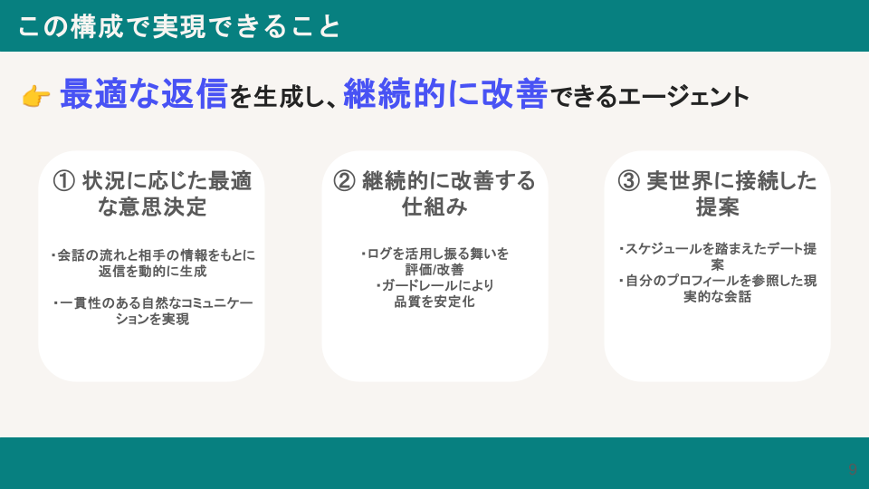
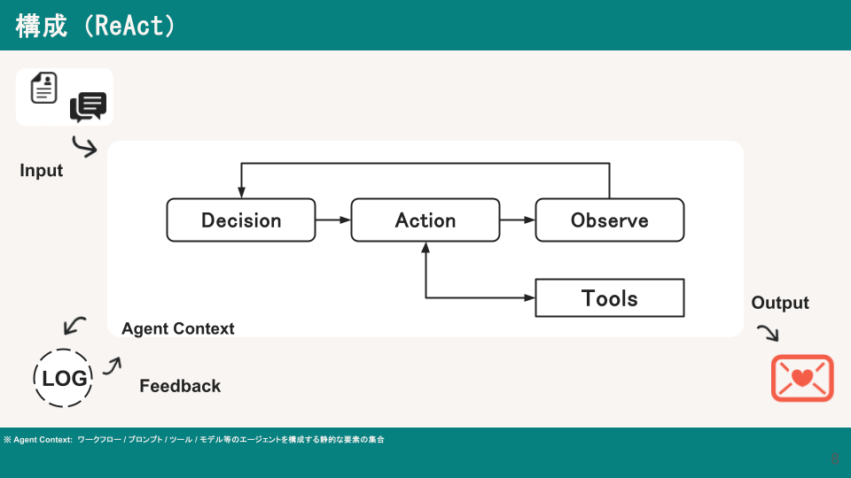
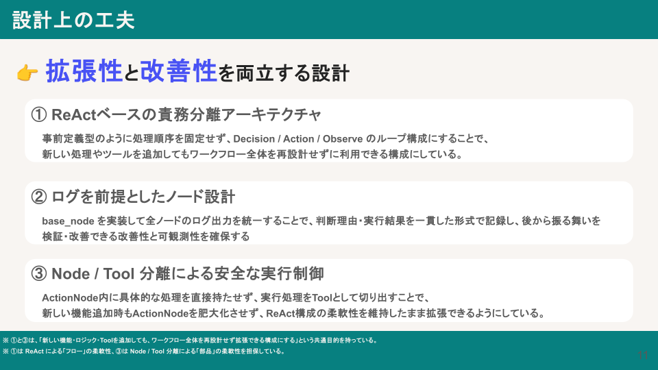
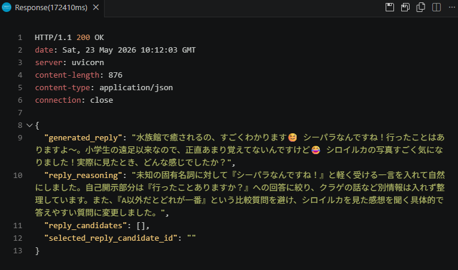

# Dating Conversation Agent

マッチングアプリの返信を自動生成する、LangGraph ベースの会話支援エージェントです。

## 概要

> 詳細は [初回デート成立率を高めるAIエージェントの開発](docs/20260523_%E5%88%9D%E5%9B%9E%E3%83%87%E3%83%BC%E3%83%88%E6%88%90%E7%AB%8B%E7%8E%87%E3%82%92%E9%AB%98%E3%82%81%E3%82%8BAI%E3%82%A8%E3%83%BC%E3%82%B8%E3%82%A7%E3%83%B3%E3%83%88%E3%81%AE%E9%96%8B%E7%99%BA.pdf) を参照してください。

単なるテキスト生成ツールではなく、会話の文脈・相手の温度感・フェーズを分析したうえで **意思決定（ReAct）** を行い、最適な返信を生成します。



### 解決する課題

- 返信文章を考えるコストが高い
- 何を書けばいいか分からず無難な返信になりがち
- 相手の温度感・誘うタイミングが判断できない

### アプローチ

1. **状況分析** — 会話フェーズ・相手の興味・自分のプロフィールとの整合性を把握
2. **意思決定（ReAct）** — 質問・共感・自己開示・デートの誘いなどアクションを選択
3. **返信生成** — 自然さ・流れを考慮したメッセージを生成・評価・改善

## アーキテクチャ



```
FastAPI (entrypoint)
  └─ LangGraph (build_graph.py)
       ├─ DecisionNode    — 次のアクションを意思決定
       ├─ ActionNode      — ツールを実行
       ├─ ObserveNode     — 実行結果を観察・ループ制御
```

すべてのノードは `BaseNode` を継承し、ログ出力・状態管理を共通化しています。

### 主要ツール

| ツール | 役割 |
|---|---|
| `get_history_and_facts` | 相手のプロフィールと会話履歴を取得し、住んでいる地域などの重要な情報を抽出する |
| `generate_reply` | 相手のプロフィールと会話履歴を参考に、自然な返信を生成する |
| `invite_date_reply` | 重要情報と店舗候補を使って、デート場所と日時を含む誘い文を生成する |
| `generate_first_message` | 会話履歴がない相手に対して、プロフィールを基に自然で具体性のある初回メッセージを生成する |
| `refine_reply` | 評価結果の指摘事項を反映して、既存の返信案を修正・改善する |
| `evaluate_reply` | 生成済み返信の安全性・ルール・品質・プロフィール適合度を一括評価する |
| `evaluate_invite_reply` | デートへ誘う返信の安全性とデート誘い専用ルールを一括評価する |

### 状態スキーマ

- **ReactState** — LangGraph ノード間を流れる作業状態（思考・意思決定・アクション結果）
- **CanvasData** — 最終成果物（返信内容・候補・選択結果）



## セットアップ

### 前提条件

- Python 3.12+
- [uv](https://docs.astral.sh/uv/)（パッケージ管理）
- MLflow サーバー（トレーシング用）
- OpenAI API キー

### インストール

```bash
git clone https://github.com/naoki359/dating-conversation-agent.git
cd dating-conversation-agent
uv sync
```

### 環境変数

`.env` ファイルをプロジェクトルートに作成します。

```env
OPENAI_API_KEY=your_openai_api_key
AGENT_PIPELINE_MODE=react
```

### MLflow の起動

```bash
uv run mlflow server --host 127.0.0.1 --port 5000
```

### プロフィールファイルの作成

`data/self_profile.sample.yaml`をコピーして`self_profile.yaml`を作成してください。

**bash / macOS / Linux:**

```bash
cp data/self_profile.sample.yaml data/self_profile.yaml
```

**PowerShell:**

```powershell
Copy-Item data/self_profile.sample.yaml data/self_profile.yaml
```

## 実行

### サーバー起動

```bash
uv run python -m uvicorn app.agent.entrypoint:app --reload --app-dir src 
```

### 返信生成リクエスト

`id` にはリクエスト対象のユーザーID（`data/test_user/` に配置した YAML ファイルのベース名）を指定します。
エージェントが会話履歴・プロフィールを読み込み、返信候補を生成して返します。

**bash / macOS / Linux:**

```bash
curl -X POST http://127.0.0.1:8000/reply \
  -H "Content-Type: application/json" \
  -d '{"id": "with_0003_test"}'
```

**PowerShell:**

```powershell
Invoke-RestMethod -Method Post -Uri http://127.0.0.1:8000/reply `
  -ContentType "application/json" `
  -Body '{"id": "with_0003_test"}'
```

ヘルスチェック:

```bash
curl http://127.0.0.1:8000/health
```

#### 捕捉（推奨）

VSCodeの拡張機能であるREST Clientをインストールすることで`./requests/reply.rest`からAPIのキックが可能

#### 実行結果



## ユーザーデータ形式

`data/test_user/` に YAML ファイルを配置します。

ファイル名はuser_idと同一（with_xxxx.yaml）にすること

```yaml
user_id: with_xxxx

profile:
  name: はる
  age: 28
  raw_profile_text: |
    プロフィールテキスト
  profile_summary: サマリ
  meeting_timing_preference: 気が合えば会いたい
  picture:
    - description: 焼肉を食べている写真
      message_hint: 共通点として話題にできるかも

conversation:
  messages: []
  updated_at: 2026-04-11T00:40:00+09:00
```

## プロジェクト構成

```
src/app/agent/
├── core/
│   ├── config/       # 設定
│   ├── graph/        # LangGraph グラフ定義
│   ├── nodes/        # 各ノード実装
│   │   ├── base_node.py
│   │   ├── decision/
│   │   ├── action/
│   │   ├── observe/
│   ├── schemas/      # 状態・スキーマ定義
│   ├── services/     # 外部リソースアクセス
│   ├── tools/        # ツール群
│   └── utils/        # ロガー・共有ストアなど
├── agent_ops/        # エージェント運用系（未実装）
└── entrypoint.py     # FastAPI エントリポイント
data/
├── user/             # ユーザープロフィール・会話履歴 (YAML)
├── test_user/        # テスト用ユーザーデータ
└── agent_logs/       # エージェントヒント
```

## 技術スタック

| カテゴリ | ライブラリ |
|---|---|
| API サーバー | FastAPI + Uvicorn |
| グラフ実行 | LangGraph |
| LLM | LangChain + OpenAI |
| トレーシング | MLflow |
| バリデーション | Pydantic |
